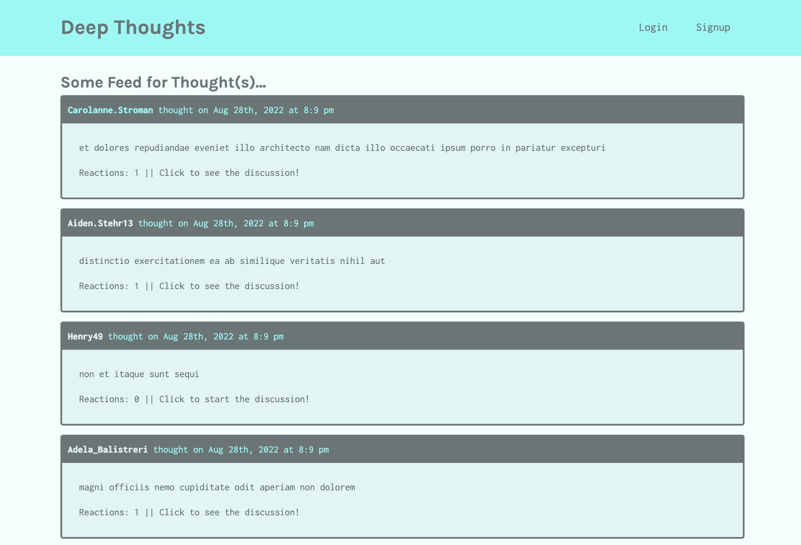

# deep-thoughts
Week 21 - Full Stack Social Media App 

## Description
This is an app I built at Vanderbilt University's Coding Boot Camp. It runs on Node with MongoDB & GraphQL and uses React and State for rendering.

Users are able to become friends with each other, post thoughts and react to other thoughts in the system.

I created two models for this to work: Users and Thoughts. The User-model self-references itself to build a friend list for each user. The Thought-model contains the reactions that are then saved within each thought.

## Table of Contents

- [Installation](#installation)
- [Usage](#usage)
- [Contributing](#contributing)
- [Questions](#questions)

## Installation
1. Clone the repository
2. Install with `NPM I`
3. Seed with `NPM RUN SEED`

## Usage
For a local development environment, run `NPM RUN DEVELOP`.

The app is deployed on Heroku [here](https://boiling-shore-75096.herokuapp.com/). 